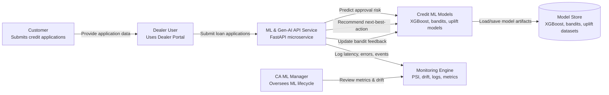

# 🚗 **CREDIT ACCEPTANCE ML & GEN-AI FLYWHEEL DEMO — END-TO-END ML ENGINEERING SYSTEM**
### **Approval Risk Modeling • Dealer Personalization • Causal Uplift • Gen-AI Copilots • Monitoring • APIs • MLOps**

This repository is a complete ML engineering portfolio project, created to demonstrate the capabilities required for a Senior Manager, ML Engineering position at Credit Acceptance.

### **It includes:**

- Credit Approval ML model (**XGBoost**)
- Dealer Recommendation Engine (contextual bandit with Thompson Sampling)
- Lifecycle Uplift Model (Causal Meta-Learner)
- Feature engineering pipeline
- Monitoring & drift detection (custom PSI implementation)
- Production-ready FastAPI service
- C4 high-level system architecture

### **This project reflects the core responsibilities in enterprise-scale ML leadership roles:**

- Leading ML engineers
- Delivering production-grade platforms
- Collaborating with product, compliance, operations
- Operationalizing ML systems (monitoring, drift, pipelines)
- Architecting scalable, secure solutions

---
### **Written for Hiring Managers & Directors of Engineering**

Credit risk, dealer performance, and lifecycle customer management all share one theme:
- AI systems must continuously learn, adapt, and create a flywheel of value.
- This project simulates how such a flywheel operates at Credit Acceptance:

### **1. Credit Approval Model (Decision Science Foundation)**

The synthetic XGBoost model predicts the probability of a “bad outcome” (default, charge-off, severe delinquency).
This mirrors a real-world underwriting risk pipeline:

- applicant income
- loan amount
- vehicle age
- dealer and region indicators
- engineered features like income-to-loan ratio

### **2. Dealer Optimization (Bandits + Personalization)**

Dealers behave differently across regions, inventory mixes, and customer segments.
A contextual bandit recommender surfaces the best-performing layout or next action for each dealer.

This simulates:

- UI layout tests
- call-to-action optimization
- workflow step sequencing
- promotion targeting

### **3. Lifecycle Uplift Modeling**

**Causal ML (uplift modeling) helps determine:**

- which customers should receive interventions
- which actions increase repayment likelihood
- which incentives drive outcome improvements

**This mirrors:**

- retention
- hardship programs
- refinancing offers
- collections strategies

### **4. Serving Layer (FastAPI)**

**A clean, production-grade API exposes:**

- approval predictions
- dealer action recommendations
- bandit feedback updates
- monitoring endpoints

This is how ML interacts with product, dealer systems, and loan origination workflows.
### **5. Monitoring, Drift & Metrics**

Real ML systems require observability.

**This project includes:**

- Latency tracking
- Error tracking
- Approval / review rates
- PSI (population stability index) drift detection

**This demonstrates readiness for:**

- model governance
- Responsible AI
- experiment tracking
- auditability

**Why This Matters to Credit Acceptance**

The company emphasizes:
- risk-adjusted decisions
- customer empathy
- dealer partnership
- ethical and data-driven operations
- high-quality software engineering

This repo reflects all of those principles.


---


## 🚀 Project Structure

```
credit-acceptance-ml-ai-flywheel-demo/
│
├── data/
│   ├── raw/                   # Original or synthetic raw data
│   ├── processed/             # Train/test splits and bandit context
│   └── models/                # Serialized trained models
│
├── src/
│   └── ca_ml_flywheel/
│       ├── features/
│       │   └── credit_features.py
│       ├── models/
│       │   ├── train_approval_model.py
│       │   ├── bandit_recommender.py
│       │   └── train_lifecycle_uplift.py
│       └── serving/
│           ├── api.py         # FastAPI serving layer
│           ├── monitoring.py  # In‑memory monitoring + PSI
│           └── __init__.py
│
├── pyproject.toml
└── README.md
```

---

## 📦 Features

### **1. Credit Approval Model (XGBoost)**
- Trained on synthetic credit application data.
- Predicts **probability of bad outcome**.
- Threshold-based decision: _APPROVE_ vs _REVIEW_.
- Saved to:  
  `data/models/credit_approval_xgb.joblib`

### **2. Bandit Recommender (Dealer Personalization)**
- Thompson Sampling bandit.
- Uses contextual metadata from:  
  `data/processed/dealer_bandit_context.csv`
- Provides dealer-specific layout recommendations.

### **3. Lifecycle Uplift Model (Causal ML)**
- Demonstrates how uplift modeling integrates into a full ML flywheel.
- Produces:  
  `data/processed/lifecycle_uplift_dataset.csv`

### **4. Monitoring & Metrics**
Custom lightweight monitoring system:
- Latencies  
- Error counts  
- Approval/review rates  
- PSI (Population Stability Index)

Exposed via:

```
GET /metrics
GET /health
```

### **5. Fully Functional FastAPI Server**

Run:

```
uvicorn src.ca_ml_flywheel.serving.api:app --reload
```

Swagger UI:

```
http://localhost:8000/docs
```

Endpoints:

- `POST /predict/approval`
- `POST /recommend/dealer-next-action`
- `POST /bandit/update`
- `GET /metrics`
- `GET /health`

---

## 🛠 Training Pipelines

### Train Credit Approval Model
```
python -m src.ca_ml_flywheel.models.train_approval_model
```

### Train Bandit Context (synthetic)
```
python -m src.ca_ml_flywheel.models.bandit_recommender
```

### Train Lifecycle Uplift Dataset
```
python -m src.ca_ml_flywheel.models.train_lifecycle_uplift
```

All models and processed datasets are automatically written into:

```
data/processed/
data/models/
```

---

## 🔧 Installation

Create a virtual environment and install dependencies:

```
python -m venv .venv
.\.venv\Scripts\activate
pip install -r requirements.txt
```

Or, if using `pyproject.toml`, run:

```
pip install .
```

---

## 🏢 Why This Project Matches Credit Acceptance

This demo showcases the same engineering principles required for the Senior Manager role:

✔ ML + Gen-AI engineering  
✔ Graphs, bandits, LLM-oriented workflows  
✔ Model lifecycle management  
✔ API deployment & monitoring  
✔ Business-value flywheel thinking  
✔ Experimentation (uplift, bandits, causal ML)  
✔ Scalable, production-minded project structure  

---

## 📬 Portfolio Use

This repository is structured intentionally to demonstrate:

- ML engineering leadership
- Full-stack ML system design
- Production-grade architecture
- Hands-on coding & mentoring capability

---

## 📄 License
MIT License
